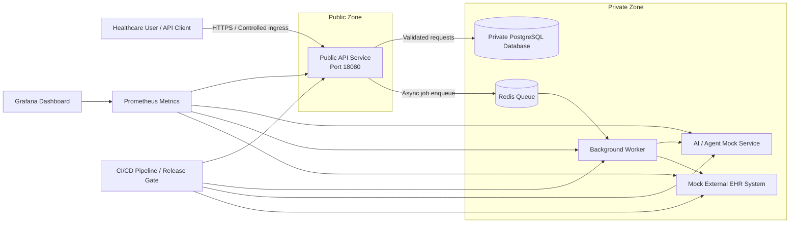

# Architecture Document

## Overview

This project simulates a secure, reliable, and observable cloud infrastructure for an AI-powered healthcare platform. The architecture is intentionally local and self-contained, allowing the evaluator to run, inspect, and recover the environment without a real cloud provider account.

## Primary architecture diagram

## Public and private boundaries

The system is split into the following trust zones:

- Public zone
  - API service
  - ingress control via a single public endpoint

- Private zone
  - AI agent service
  - background worker
  - Redis queue
  - PostgreSQL database
  - mock EHR integration service

## Service responsibilities

### Public API service
- Receives appointment requests from outside the simulated environment.
- Validates input.
- Stores request metadata in the private database.
- Enqueues asynchronous work for the worker.

### AI agent mock
- Simulates an internal AI/agent service.
- Produces a structured decision for the worker.
- Demonstrates controlled internal service interaction.

### Background worker
- Consumes jobs from the queue.
- Invokes the AI service and mock EHR service.
- Updates appointment state.
- Demonstrates retry and failure handling behavior.

### Database
- Stores appointment state.
- Remains private and not directly exposed to the public.

### Mock EHR service
- Simulates an external healthcare system.
- Produces success, slow, timeout, authentication failure, and temporary outage responses.

## Reliability strategy

- Multiple services are separated by trust boundaries.
- Health checks are available on every service.
- Worker queue depth and processing rate can be observed.
- The queue allows asynchronous behavior and backlog handling.
- Rollback-ready versioning is supported by the deployment scripts and CI/CD workflow.
- Compose health-gated dependencies prevent API and worker startup before PostgreSQL, Redis, AI, and EHR are ready.
- Internal host bindings use `127.0.0.1`; service-to-service traffic uses the private Compose network.

## Observability strategy

- Prometheus scrapes HTTP metrics from services.
- Grafana can visualize service health and queue behavior.
- Structured application logs are available from container output.
- Health endpoints support deployment verification and troubleshooting.

## Security strategy

- Secrets are represented as environment variables rather than hard-coded values.
- Internal services communicate over private container network paths.
- Database is not exposed publicly.
- Administrative surfaces are intentionally limited.
- Custom service images run as the non-root `appuser` account.
- Docker Scout is available as the image CVE scanning gate when the operator is authenticated.

## Environment and recovery

- Development uses `docker-compose.yml` and the local `.env` file.
- Production-like local execution overlays `docker-compose.prod.yml` without duplicating the base infrastructure.
- `scripts/backup_db.ps1` creates a SQL backup and `scripts/restore_db.ps1` recreates the appointment table from that backup.
- `scripts/rollback.ps1` removes an unsafe local override, starts the last locally built images, waits for health, and verifies service endpoints.

## Failure scenarios supported

- Worker outage
- Queue backlog growth
- External EHR slow responses or failures
- Failed deployment
- Infrastructure recreation

## Important trade-offs

- Local simulation is easier to run and validate than a production cloud deployment.
- The mock EHR and mock AI services make failure demonstration simpler.
- The design focuses on infrastructure operations and engineering decisions rather than a full healthcare application.
- One local PostgreSQL and Redis instance keeps the simulation inexpensive and reproducible, but remains a single point of failure; managed HA services would improve availability at higher cost.
- API and worker capacity are separate processes and can be scaled independently in a real orchestrator; fixed local container names favor simple evaluator commands.
- Docker Scout provides stronger image coverage than pattern scanning, but requires Docker authentication to query vulnerability data.
